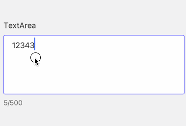

# TextArea

A widget to react with user for multiple line content

- props

| Property      | Description                           | Type                                           | Default |
|---------------|---------------------------------------|------------------------------------------------|---------|
| style         | style for containe of `TextArea`      | `any`                                          | -       |
| status        | show different status of `TextArea`   | `success` \| `error` \| `warning`              | -       |
| value         | value of `TextArea`                   | `string`                                       | -       |
| textStyle     | style of text part                    | `any`                                          | -       |
| onChange      | callback when text changes            | `function`                                     | -       |
| placeholder   | placeholder for `TextArea`            | `string`                                       | -       |
| showCount     | whether show count number             | `boolean`                                      | false   |
| countStyle    | style of count                        | `any`                                          | -       |
| disabled      | whether `TextArea` is disabled or not | `boolean`                                      | `false` |
| returnKeyType | return key type of the keyboard       | `done` \| `go` \| `next` \| `search` \| `send` | -       |

```tsx
<TextArea showCount />
```

