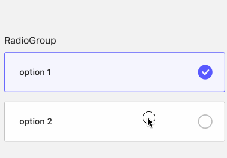

# RadioGroup

A widget for user for choose options

- props

| Property       | Description                         | Type                               | Default |
|----------------|-------------------------------------|------------------------------------|---------|
| style          | style for containe of `RadioGroup`  | `any`                              | -       |
| textStyle      | style of option text                | `any`                              | -       |
| value          | value of `RadioGroup`               | `string`                           | -       |
| onChange       | callback when option change         | `function`                         | -       |
| options        | options for `RadioGroup`            | `{label: string, value: string}[]` | -       |

```tsx
<RadioGroup 
  options={[
    {
      label: 'option 1',
      value: 'option 1',
    },
    {
      label: 'option 2',
      value: 'option 2',
    }
  ]}
/>
```


