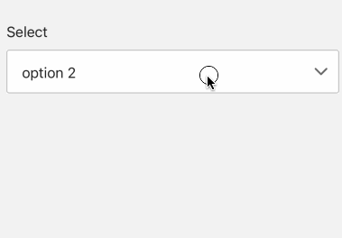

# Select

A widget for user to select options, often used for province/city selection

- props

| Property       | Description                       | Type                               | Default |
|----------------|-----------------------------------|------------------------------------|---------|
| style          | style for containe of `Select`    | `any`                              | -       |
| status         | show different status of `Select` | `success` \| `error` \| `warning`  | -       |
| value          | value of `Select`                 | `string`                           | -       |
| onChange       | callback when option change       | `function`                         | -       |
| options        | options for `Select`              | `{label: string, value: string}[]` | -       |
| textStyle      | style of option text              | `any`                              | -       |
| disabled       | whether disable the widget        | `boolean`                          | fasle   |

```tsx
<Select 
  options={[
    {
      label: 'option 1',
      value: 'option 1',
    },
    {
      label: 'option 2',
      value: 'option 2',
    }
  ]}
/>
```

