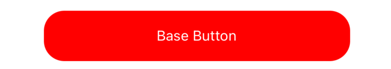
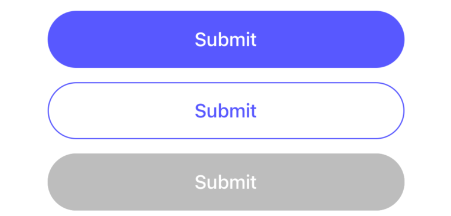

# Button

Button is the common widget for click action. And we have [**FWButton**](#fwbutton) and [**CWButton**](#cwbutton)  derived from it.   
We usually use FWButton and CWButton instead of Button directly.

- props

| Property       | Description                                                    | Type        | Default |
|----------------|----------------------------------------------------------------|-------------|---------|
| action         | only used in Form to tell form it will trigger `onFinish`      | `submit`    |     -   |
| containerStyle | customize the style of button container                        | `any`       |     -   |
| textStyle      | customize the style of text in button                          | `any`       |     -   |
| text           | showing text in button                                         | `string`    |     -   |
| children       | you can customze the inner content instead of providing `text` | `ReactNode` |     -   |
| onClick        | when button click, what to do                                  | `void`      |     -   |
| disabled       | whether button is disabled                                     | `boolean`   |     -   |
| capitalize     | whether show uppercases of text                                | `boolean`   |     -   |

```tsx
<Button 
  text={'Base Button'}
  containerStyle={{ width: 300, height: 50, borderwidth: 1, borederColor: '#ccc', backgroundColor: '#f00', borderRadius: 20 }}
  textStyle={{ color: '#fff' }}
  onClick={() => {SimpleToast.show('Submit')}}
/>
```


## FWButton 

Full Width Button

```tsx
<Button.FWButton
  style={{ width: 300 }}
  text={'Submit'}
  onClick={() => {SimpleToast.show('Submit')}}
/>
```


## CWButton

Custom Width Button

```tsx
<Button.CWButton
  style={{ marginHorizontal: 32, marginVertical: 12 }}
  text={'Submit'}
  onClick={() => {SimpleToast.show('Submit')}}
/>
```

