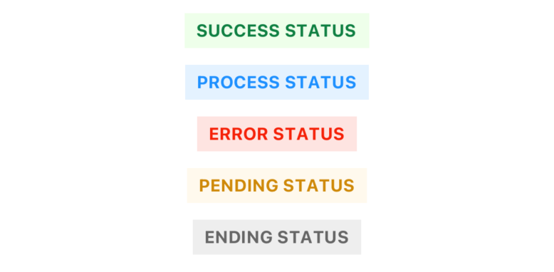

# Status

A widget to dipslay status

- props

| Property | Description                    | Type                                                     | Default |
|----------|--------------------------------|----------------------------------------------------------|---------|
| type     | status type                    | `success` \| `info` \| `warning` \| `error` \| `invalid` | -       |
|   status | the text for displaying status | `string`                                                 | -       |
|   style  | customize style of status      | `any`                                                    | -       |

```tsx
<Status 
  type={'success'}
  status={'SUCCESS STATUS'}
/>
```

