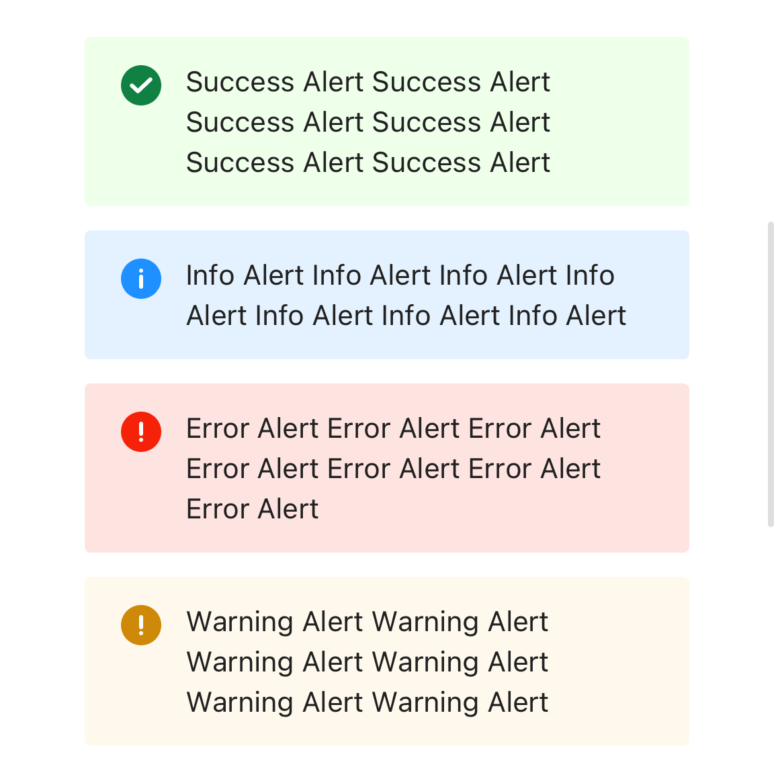

# Alert

A widget to show alert

- props

| Property  | Description                        | Type                                                     | Default |
|-----------|------------------------------------|----------------------------------------------------------|---------|
|   style   | customize style of alert container | `any`                                                    | -       |
| textStyle | cusomize style for alert text      | `any`                                                    | -       |
| type      | alert type                         | `success` \| `info` \| `warning` \| `error` \| `invalid` | -       |
| text      | alert text                         | `string`                                                 | -       |
| children  | alert content                      | `ReactNode`                                              | -       |

```tsx
<Alert
  style={{ width: 300, marginTop: 12 }}
  type={'success'}
  text={'Success Alert Success Alert Success Alert Success Alert Success Alert Success Alert '}
/>
<Alert
  style={{ width: 300 , marginTop: 12}}
  type={'info'}
  text={'Info Alert Info Alert Info Alert Info Alert Info Alert Info Alert Info Alert '}
/>
<Alert
  style={{ width: 300, marginTop: 12 }}
  type={'error'}
  text={'Error Alert Error Alert Error Alert Error Alert Error Alert Error Alert Error Alert '}
/>
<Alert
  style={{ width: 300, marginTop: 12}}
  type={'warning'}
  text={'Warning Alert Warning Alert Warning Alert Warning Alert Warning Alert Warning Alert '}
/>
```

