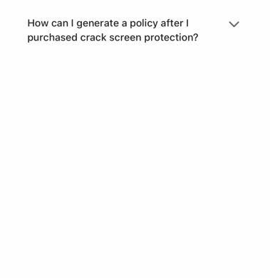

# Fold

A widge with title and content and the content is expandble.

- props

| Property     | Description                          | Type        | Default |
|--------------|--------------------------------------|-------------|---------|
|   style      | customize style for `Fold` container | `any`       | -       |
| title        | title                                | `string`    | -       |
| titleStyle   | style of title                       | `any`       | -       |
| content      | content                              | `string`    | -       |
| contentStyle | style of content                     | `any`       | -       |
| children     | content                              | `ReactNode` | -       |

```tsx
<Fold
  style={{ width: 300, marginVertical: 400}}
  title={'How can I generate a policy after I purchased crack screen protection？'}
  content={'Click the [Redeem] on home page and enter the code we sent to you through SMS and email. Policy will be generated after you entered all the codes you want to add for this policy and click [Apply] button. Once policy is generated, the max coverage and excess is determined and cannot be changed any more, and the policy will start from the code purchased date after your activation is passed.'}
/>
```

