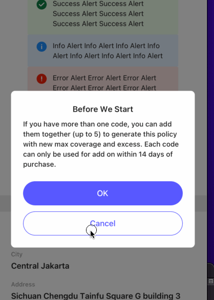

# Dialog

```tsx
<Dialog
  visible={showDialog}
  dismiss={() => setShowDialog(false)}
  title={'Before We Start'}
  content={'If you have more than one code, you can add them together (up to 5) to generate this policy with new max coverage and excess. Each code can only be used for add on within 14 days of purchase.'}
  okText={'OK'}
  onOk={() => SimpleToast.show('OK')}
  cancelText={'Cancel'}
  onCancel={() => SimpleToast.show('Cancel')}
/>
```

