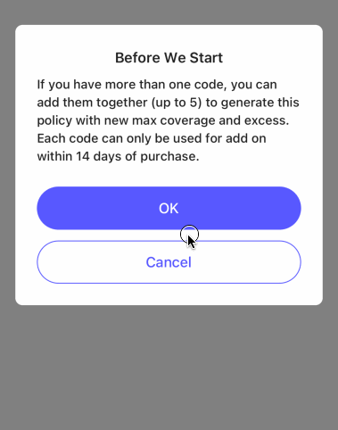

# Dialog

A common dialog implemented with Modal

- props

| Property                | Description                                                  | Type        | Default |
|-------------------------|--------------------------------------------------------------|-------------|---------|
| visible                 | variable to controller whether dialog is visible             | `boolean`   | -       |
| dismiss                 | function to set varible of `visible`, co-work with `visible` | `function`  | -       |
| style                   | style of dialog continer                                     | `any`       | -       |
| title                   | title                                                        | `string`    | -       |
| titleStyle              | style of title                                               | `any`       | -       |
| content                 | content                                                      | `string`    | -       |
| contentStyle            | style of content                                             | `any`       | -       |
| children                | content                                                      | `ReactNode` | -       |
| okText                  | text of positive button                                      | `string`    | -       |
| okStyle                 | style of positive button                                     | `any`       | -       |
| cancelText              | text of negative button                                      | `string`    | -       |
| cancelStyle             | style of negative button                                     | `any`       | -       |
| onOk                    | trigger when positive button is clicked                      | `function`  | -       |
| onCancel                | trigger when negative button is clicked                      | `function`  | -       |
| touchOutsideCancellable | dismiss dialog when touch outsid of dialog                   | `boolean`   | false   |


```tsx
<Dialog
  visible={showDialog}
  dismiss={() => setShowDialog(false)}
  title={'Before We Start'}
  content={'If you have more than one code, you can add them together (up to 5) to generate this policy with new max coverage and excess. Each code can only be used for add on within 14 days of purchase.'}
  okText={'OK'}
  onOk={() => SimpleToast.show('OK')}
  cancelText={'Cancel'}
  onCancel={() => SimpleToast.show('Cancel')}
/>
```

