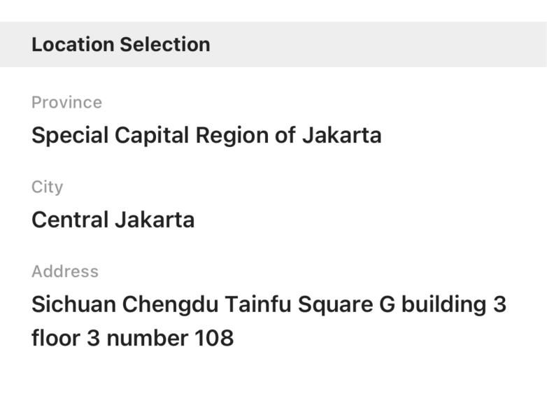

# Card

A widget to show general info with card style, the child is [Card.Item](#carditem)

- props
  
| Property   | Description            | Type        | Default |
|------------|------------------------|-------------|---------|
| style      | style of Card continer | `any`       | -       |
| title      | title                  | `string`    | -       |
| titleStyle | style of title         | `any`       | -       |
| children   | content of Card        | `Card.Item` | -       |

```tsx
<Card 
  title={'Location Selection'}
>
  <Card.Item label={'Province'} value={'Special Capital Region of Jakarta'}/>
  <Card.Item label={'City'} value={'Central Jakarta'}/>
  <Card.Item label={'Address'} value={'Sichuan Chengdu Tainfu Square G building 3 floor 3 number 108'}/>
  <Card.Item label={'Photo'} value={
    <Preview 
      files={previewFiles}
    />
  }/>
</Card>
```



## Card.Item

| Property   | Description            | Type     | Default |
|------------|------------------------|----------|---------|
| style      | style of Card continer | `any`    | -       |
| label      | label                  | `string` | -       |
| labelStyle | style of label         | `any`    | -       |
| value      | value                  | `string` | -       |
| valueStyle | style of value         | `any`    | -       |
