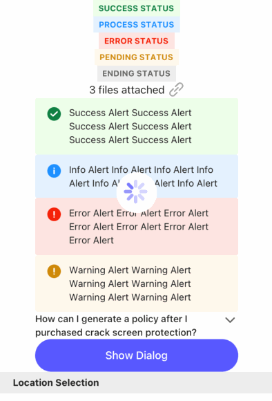

# Loading

A common widget to show loading status

- props

| Property | Description          | Type               | Default |
|----------|----------------------|--------------------|---------|
| visible  | whether show loading | `boolean`          | false   |
| color    | color                | `color string`     | -       |
| size     | size                 | `small` \| `large` | large   |

