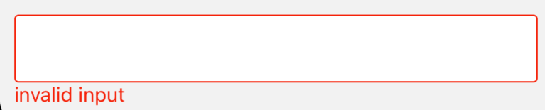

# Usage

## Form

Form is a wrapper for inner component and it should co-work with inner [Field](#field).

- props

| Property       | Description                                                 | Type       | Default |
|----------------|-------------------------------------------------------------|------------|---------|
| onFinish       | callback when form is submitted and rules validation passed | `function` | -       |
| onFinishFailed | callback when form is submitted and rules validation failed | `function` | -       |
| initialValues  | initla values for form field                                | `any`      | -       |


:::tip

We must put an `Button` widget with action `submit` in the form to trigger the action of submit.

:::


```tsx
<Form
  onFinish={(values: any) => {
    console.log(`values = `, values);
  }}
  onFinishFailed={({errors, values}: {errors: any, values: any}) => {
    console.log(`errors = `, errors);
    console.log(`values = `, values);
  }}
  initialValues={{
    input: '123',
  }}
>
  <Field label="Input" name="input" rule={{type: 'string', required: true}}>
    <Input />
  </Field>
  <Button.FWButton text='click' action='submit'/>
</Form>
```


## Field

A wrapper for Element, it can be used with [Form](#form) or without [Form](#form) individually.   
The feature of Field is to provide `label`, `help`, `extra`, `validateStatus`, `rules`, etc.

- props
  
| Property          | Description                                                                                   | Type                                                                                                                   | Default    |
|-------------------|-----------------------------------------------------------------------------------------------|------------------------------------------------------------------------------------------------------------------------|------------|
| name              | for `Form` to identify each element                                                           | `string`                                                                                                               | -          |
| label             | show the label for each element                                                               | `string`                                                                                                               | -          |
| validateStatus    | show different status of element                                                              | `success` \| `error` \| `warning`                                                                                      | -          |
| help              | show error message for element, co-work with `validateStatus`                                 | `string`                                                                                                               | -          |
| extra             | show extra description for element                                                            | `string`                                                                                                               | -          |
| rule              | rule for [async-validator](https://github.com/yiminghe/async-validator) to validate the field | [rule](https://github.com/yiminghe/async-validator/blob/a6d0eaf87d65511da85b9485f3f780036ddc5675/src/interface.ts#L76) | -          |
| children          | inner element, can only be on child                                                           | `ReactNode`                                                                                                            | -          |
| valuePropsName    | the prorps name for retrieving value                                                          | `string`                                                                                                               | `value`    |
| onChangePropsName | the props name for callback of value change                                                   | `string`                                                                                                               | `onChange` |
| eventPropsName    | the props name for [lodash](https://github.com/lodash/lodash) to retriving value from event   | `string`                                                                                                               | -          |

```tsx
<Field label="Input" name="input" validateStaus='error' help='invalid input'>
  <Input />
</Field>
```

