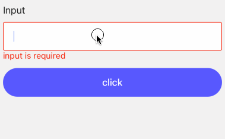

# Usage

- props

| Property       | Description                                                 | Type       | Default |
|----------------|-------------------------------------------------------------|------------|---------|
| onFinish       | callback when form is submitted and rules validation passed | `function` | -       |
| onFinishFailed | callback when form is submitted and rules validation failed | `function` | -       |
| initialValues  | initla values for form field                                | `any`      | -       |


:::tip

We must put an `Button` widget with action `submit` in the form to trigger the action of submit.

:::


```tsx
<Form
  onFinish={(values: any) => {
    console.log(`values = `, values);
  }}
  onFinishFailed={({errors, values}: {errors: any, values: any}) => {
    console.log(`errors = `, errors);
    console.log(`values = `, values);
  }}
  initialValues={{
    input: '123',
  }}
>
  <Field label="Input" name="input" rule={{type: 'string', required: true}}>
    <Input />
  </Field>
  <Button.FWButton text='click' action='submit'/>
</Form>
```

